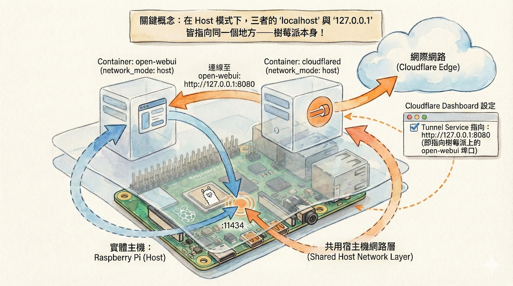
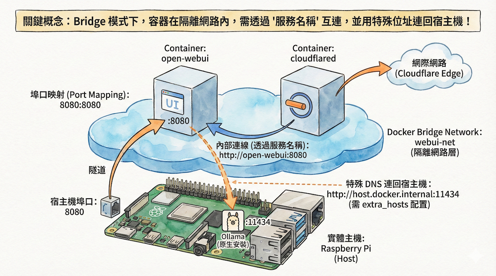

# 使用Docker compose,快速部署open-webui相關容器

## 以下docker是安裝在Raspberry Pi本機上

> ollama是安裝在raspberry pi本機上

主要是以network bridge模式部署,可以快速部署open-webui,cloudflare tunnel,pipeline server,MCPO server等相關容器

- **1.open-webui和 cloudflare tunnel 部署**
- **2.open-webui,cloudflare tunnel 和 MCPO 部署**
- **3.open-webui, cloudflare tunnel 和 pipeline 部署**
- **4.open-webui, cloudflare tunnel 和 pipeline 和 MCPO 部署**

## 1.open-webui和 cloudflare tunnel 部署

### 方法1:使用 Docker Compose - host network模式



如果您希望使用 Docker Compose 來管理多個容器，可以使用以下方式統一部署 Open WebUI 和 Cloudflare Tunnel。

#### 為什麼要使用 network_mode: host？


**只要三者需要共用 `127.0.0.1`，使用 `network_mode: host`**


**架構關係圖：**

```
[ Internet ]
     │
     ▼
Cloudflare Tunnel
     │  (cloudflared container)
     ▼
host主機
     │
     ├── Open WebUI : http://127.0.0.1:8080
     └── Ollama     : http://127.0.0.1:11434
```

👉 **重要觀念：**

* Tunnel **不是連 cloudflared container 容器**
* Tunnel **是連 open-webui container**

#### 建立 docker-compose.yml

請在任意資料夾建立一個檔案 `docker-compose.yml`，內容如下：

```yaml
version: "3.9"

services:
  open-webui:
    image: ghcr.io/open-webui/open-webui:main
    container_name: open-webui
    restart: always
    network_mode: host
    volumes:
      - open-webui:/app/backend/data
    environment:
      OLLAMA_BASE_URL: http://127.0.0.1:11434

  cloudflared:
    image: cloudflare/cloudflared:latest
    container_name: cloudflared
    restart: unless-stopped
    network_mode: host
    command: tunnel run --token <TOKEN>

volumes:
  open-webui:
    external: true
```


#### 啟動與管理方式

**啟動服務：**

```bash
docker compose up -d
```

**檢查容器狀態：**

```bash
docker compose ps
```

**查看日誌（非常重要，用於排查問題）：**

```bash
docker compose logs -f cloudflared
```

#### 進階改良建議（選用）

等您熟悉基本操作後，可以考慮以下優化：

**1. 使用環境變數檔案（.env）管理 Token**

建立 `.env` 檔案：

```
CLOUDFLARE_TOKEN=xxxxx
```

在 `docker-compose.yml` 中使用：

```yaml
command: tunnel run --token ${CLOUDFLARE_TOKEN}
```

**2. 添加依賴關係**

雖然 host network 模式下不強制，但可以加上 `depends_on` 來確保啟動順序。

---

```yaml
docker compose up -d
```

### 方法2:使用 Docker Compose(推薦) - bridge network模式

如果您希望使用 Docker Compose 來管理多個容器，可以使用以下方式統一部署 Open WebUI 和 Cloudflare Tunnel。

#### 為什麼要使用 bridge network模式？




#### 建立 docker-compose.yml

請在任意資料夾建立一個檔案 `docker-compose.yml`，內容如下：

```yaml
version: "3.9"

services:
  open-webui:
    image: ghcr.io/open-webui/open-webui:main
    container_name: open-webui
    restart: always
    networks:
      - webui-net
    ports:
      - "8080:8080" # 宿主機可用 http://localhost:8080 存取
    volumes:
      - open-webui:/app/backend/data
    environment:
      OLLAMA_BASE_URL: http://host.docker.internal:11434
    extra_hosts:
      - "host.docker.internal:host-gateway" # Linux/Raspberry Pi 需要這行才能解析

  cloudflared:
    image: cloudflare/cloudflared:latest
    container_name: cloudflared
    restart: unless-stopped
    networks:
      - webui-net
    command: tunnel run --token ${CLOUDFLARE_TOKEN}
    # cloudflared 指向 open-webui 的服務名稱與 port

volumes:
  open-webui:
    external: true

networks:
  webui-net:
    name: webui-net
    driver: bridge

```

#### cloudflared網站上的tunnel設定

```
http://open-webui:8080
```


#### 啟動與管理方式

**啟動服務：**

```bash
docker compose up -d
```

**檢查容器狀態：**

```bash
docker compose ps
```

**查看日誌（非常重要，用於排查問題）：**

```bash
docker compose logs -f cloudflared
```

#### 進階改良建議（選用）

等您熟悉基本操作後，可以考慮以下優化：

**1. 使用環境變數檔案（.env）管理 Token**

建立 `.env` 檔案：

```
CLOUDFLARE_TOKEN=xxxxx
```

在 `docker-compose.yml` 中使用：

```yaml
command: tunnel run --token ${CLOUDFLARE_TOKEN}
```

**3. 添加依賴關係**

雖然 host network 模式下不強制，但可以加上 `depends_on` 來確保啟動順序。

---

```yaml
docker compose up -d
```

## 2.open-webui, cloudflare tunnel 和 pipeline 部署

> 注意: pipeline 的ports: 9099:9099 被拿掉,代表無法透過raspberry連線到pipeline的容器, 只可以透過service name連線到pipeline的容器, `所以open-webui的連線pipeline的url需要改成http://pipelines:9099`

> 注意: pipeline 的 extra_hosts:不可以拿掉, 因為pipeline的容器需要解析host.docker.internal的ip地址,`才可以連線raspberry內的ollama模型`

```yaml
services:
  open-webui:
    image: ghcr.io/open-webui/open-webui:main
    container_name: open-webui
    restart: always
    networks:
      - webui-net
    ports:
      - "8080:8080"
    volumes:
      - open-webui:/app/backend/data
    environment:
      OLLAMA_BASE_URL: http://host.docker.internal:11434
    extra_hosts:
      - "host.docker.internal:host-gateway"

  pipelines:
    image: ghcr.io/open-webui/pipelines:main
    container_name: pipelines
    restart: always
    networks:
      - webui-net
    volumes:
      - pipelines:/app/pipelines
    extra_hosts:
      - "host.docker.internal:host-gateway"

  cloudflared:
    image: cloudflare/cloudflared:latest
    container_name: cloudflared
    restart: unless-stopped
    networks:
      - webui-net
    command: tunnel run --token ${CLOUDFLARE_TOKEN}
    # Cloudflare Tunnel 會在 Cloudflare Dashboard 指向 open-webui:8080

volumes:
  open-webui:
    external: true
  pipelines:
    external: true

networks:
  webui-net:
    name: webui-net
    driver: bridge
```

## 3.open-webui,cloudflare tunnel 和 MCPO 部署
```bash
docker compose up -d
```

## 4.open-webui, cloudflare tunnel 和 pipeline 和 MCPO 部署
```bash
docker compose up -d
```
