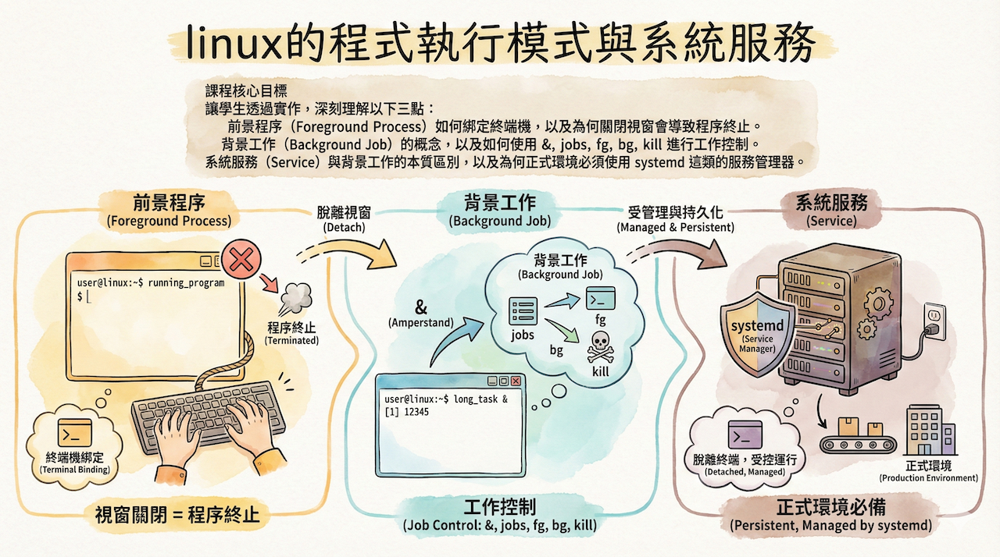

# 教案：前景程序、背景工作與系統服務

## 課程核心目標

讓學生透過實作，深刻理解以下三點：
1.  **前景程序 (Foreground Process)** 如何綁定終端機，以及為何關閉視窗會導致程序終止。
2.  **背景工作 (Background Job)** 的概念，以及如何使用 `&`, `jobs`, `fg`, `bg`, `kill` 進行工作控制。
3.  **系統服務 (Service)** 與背景工作的本質區別，以及為何正式環境必須使用 `systemd` 這類的服務管理器。

---

## 1️⃣ 前景程序：一切的起點

**目標**：展示前景程序會「佔用」終端機，直到它執行完畢或被中斷。

| 老師操作 (Teacher's Action) | 預期結果 (Expected Outcome) | 解說重點 (Explanation Points) |
| :--- | :--- | :--- |
| `sleep 300` | 終端機沒有反應，無法輸入新指令。 | 1. `sleep 300` 是一個前景程序，它會持續執行 300 秒。   2. 在它結束前，這個終端機被「卡住」了，無法做其他事。 |
| 按下 `Ctrl + C` | `sleep` 命令被中斷，終端機恢復正常，可以輸入指令。 | 1. `Ctrl + C` 會送出一個 `SIGINT` 信號，意思是「請中斷」。  2. 這是終止前景程序的標準方法。 |

---

## 2️⃣ 背景工作：讓程序在背景執行

**目標**：學會使用 `&` 將程序放到背景執行，釋放終端機。

| 老師操作 (Teacher's Action) | 預期結果 (Expected Outcome) | 解說重點 (Explanation Points) |
| :--- | :--- | :--- |
| `sleep 300 &` | 畫面上出現 `[1] 12345` 這樣的字樣，然後可以立刻輸入新指令。 | 1. `&` 的意思是「在背景執行」。  2. `[1]` 是「工作編號 (Job ID)」，`12345` 是「程序編號 (PID)」。  3. 終端機立刻被釋放了，我們可以做其他事。 |
| ps aux \| grep sleep | 可以看到剛剛執行的 `sleep 300` 程序仍在列表中。 | `ps` 指令可證明程序確實還「活著」， 只是它已不在前景與我們互動。 |

---

## 3️⃣ 工作控制：管理背景工作

---

## 4️⃣ `nohup`：關閉終端機後繼續活著

**目標**：理解 `&` 的局限性，並引入 `nohup` 來解決「關閉終端機，程序就終止」的問題。

| 老師操作 (Teacher's Action) | 預期結果 (Expected Outcome) | 解說重點 (Explanation Points) |
| :--- | :--- | :--- |
| **(開啟新終端機)**   1. `sleep 300 &`   2. 關閉此終端機視窗。   3. **(回到原終端機)**   `ps aux \| grep sleep` | 找不到 `sleep` 程序。 | 1. 關閉終端機時，系統會送出 `SIGHUP` (hang-up) 信號給該終端機的所有子程序。  2. 預設情況下，程序收到 `SIGHUP` 就會終止。這就是為什麼 `cloudflared` 會斷線！ |
| **(開啟新終端機)**   1. `nohup sleep 300 &`   2. 畫面上顯示 `nohup: ignoring input and appending output to 'nohup.out'`   3. 關閉此終端機視窗。   4. **(回到原終端機)**   `ps aux \| grep sleep` | 依然可以找到 `sleep 300` 程序。 | 1. `nohup` (no hang-up) 的作用就是「忽略 SIGHUP 信號」。  2. 這樣即使關閉終端機，程序也能繼續存活。  3. **重點：** `nohup` 依然不是「服務」，它不會開機自啟，如果程序自己掛了也沒人管。 |

---

## 5️⃣ `systemd`：真正的系統服務

**目標**：闡述 `systemd` 作為現代 Linux 服務管理員的核心地位與優勢。

**這部分以講解為主，搭配 `cloudflared` 或 `sshd` 作為實際案例。**

| 核心概念 | `systemd` 的職責 | 關鍵指令 (以 `cloudflared` 為例) |
| :--- | :--- | :--- |
| **Daemon (守護程序)**：一個在背景執行、獨立於任何終端機、由系統管理的程序。 | 1. **開機自動啟動**：根據設定，在開機時自動運行服務。  2. **狀態監控**：隨時可以查詢服務的運行狀態、讀取日誌。  3. **自動重啟**：如果服務崩潰，`systemd` 可以自動將其重啟。  4. **資源管理**：可以限制服務的 CPU 和記憶體用量。 | `systemctl status cloudflared` (看狀態)  `systemctl start cloudflared` (啟動)  `systemctl stop cloudflared` (停止)  `systemctl enable cloudflared` (設為開機啟動)  `systemctl disable cloudflared` (取消開機啟動)  `journalctl -u cloudflared` (看日誌) |

---

## 6️⃣ 總結：為什麼正式環境一定要用服務

**一句話總結**
> **前景執行**是臨時測試，**背景工作**是暫時方便，**系統服務**才是讓你的程式「真正活在系統裡」的唯一方法。

**對照 `cloudflared` 案例**
- **手動執行 (`foreground`)**：適合在本機開發、除錯，能即時看到 log。
- **`nohup` 執行**：極不推薦！這是一種懶惰且不可靠的臨時方案。
- **`systemd` 服務**：正式環境的唯一選擇！確保了樹莓派重開機後，Tunnel 能自動連上，並且在意外中斷時能被系統監控和重啟。
