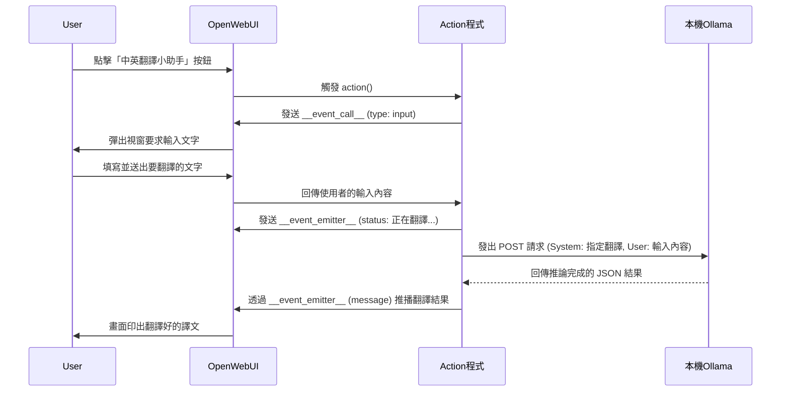

# 中英翻譯小助手

> 🌍 實用性強

```python
"""
title: Quick Translator
author: Your Name
version: 0.1.0
requirements: requests, pydantic
"""

from pydantic import BaseModel, Field
from typing import Optional
import requests
import os

class Action:
    class Valves(BaseModel):
        target_language: str = "繁體中文"
        OLLAMA_API_URL: str = Field(
            default="http://127.0.0.1:11434/v1/chat/completions",
            description="Ollama API 網址"
        )
        OLLAMA_MODEL: str = Field(
            default="llama3.2",
            description="本機 Ollama 翻譯模型名稱"
        )
        
    def __init__(self):
        self.valves = self.Valves()

    async def action(
        self,
        body: dict,
        __user__=None,
        __event_emitter__=None,
        __event_call__=None,
    ) -> Optional[dict]:
        """要求使用者輸入要翻譯的文字"""
        
        # 顯示輸入對話框
        response = await __event_call__({
            "type": "input",
            "data": {
                "title": f"翻譯成{self.valves.target_language}",
                "message": "請貼上要翻譯的文字",
                "placeholder": "在這裡貼上英文或中文...",
            }
        })
        
        user_input = response.get("message", "")
        
        if __event_emitter__:
            # 發送進度狀態
            await __event_emitter__({
                "type": "status",
                "data": {
                    "description": "正在翻譯...",
                    "done": False
                }
            })
            
            # 實際接入本機 Ollama API 進行翻譯
            try:
                payload = {
                    "model": self.valves.OLLAMA_MODEL,
                    "messages": [
                        {
                            "role": "system", 
                            "content": f"你是一個專業的翻譯助理。請將以下文字翻譯成 {self.valves.target_language}，只輸出翻譯結果，不要加上任何多餘的解釋或引言。"
                        },
                        {"role": "user", "content": user_input}
                    ],
                    "stream": False,
                    "temperature": 0.3,
                }
                headers = {"Content-Type": "application/json"}
                
                response = requests.post(
                    self.valves.OLLAMA_API_URL, 
                    json=payload, 
                    headers=headers, 
                    timeout=120
                )
                response.raise_for_status()
                result = response.json()
                translated_text = result["choices"][0]["message"]["content"]
                
                translation_result = f"### 🌍 翻譯結果 ({self.valves.target_language})\n\n**原文**:\n{user_input}\n\n**譯文**:\n{translated_text}"
                
            except Exception as e:
                translation_result = f"❌ 翻譯失敗。\n請確認本機是否已啟動 Ollama，以及模型 `{self.valves.OLLAMA_MODEL}` 是否存在。\n錯誤細節: {str(e)}"
            
            await __event_emitter__({
                "type": "message",
                "data": {
                    "content": translation_result
                }
            })
        
        return {"status": "completed"}
```
<details>
<summary>💡 程式碼說明和workflow</summary>

## 📋 程式概述
這個 Action 示範了如何利用 `__event_call__` 呼叫**彈出式輸入對話框**，並將使用者輸入的文字，透過 **OpenAI 相容的 API 格式**轉發給本機端的 Ollama 模型進行專業翻譯，最後用 `__event_emitter__` 即時顯示翻譯結果。

---

## 🔄 Workflow 流程圖



---

## 📝 關鍵技術詳解

### 1. 動態與使用者互動 (`__event_call__`)
```python
response = await __event_call__({
    "type": "input",
    "data": {
        "title": f"翻譯成{self.valves.target_language}",
        "message": "請貼上要翻譯的文字",
    }
})
user_input = response.get("message", "")
```
傳統 Action 只能取得先前講過的歷史對話。這個範例示範了**反向跟使用者要資料**。當呼叫 `type: "input"` 時，網頁上會彈出對話框，直到使用者點擊確認後，程式碼才會繼續往下走，並從 `response` 拿到使用者剛打的字。

### 2. OpenAI 相容的 API 請求與提示詞提詞 (Prompting)
```python
payload = {
    "model": self.valves.OLLAMA_MODEL,
    "messages": [
        {
            "role": "system", 
            "content": f"你是一個專業的翻譯助理。請將以下文字翻譯成 {self.valves.target_language}，只輸出翻譯結果，不要加上任何多餘的解釋或引言。"
        },
        {"role": "user", "content": user_input}
    ]
}
```
我們直接在程式碼中塞入所謂的「系統提示詞 (System Prompt)」，約束 Ollama 的說話風格（必須翻譯，且不准說廢話）。這樣使用者在介面上只需「無腦給文字」，由我們的 Action 默默在背景擔任優化提詞工程的角色。

### 3. Valves 的活用與靈活部署
```python
class Valves(BaseModel):
    target_language: str = "繁體中文"
    OLLAMA_API_URL: str = Field(default="http://127.0.0.1:11434/v1/chat/completions")
    OLLAMA_MODEL: str = Field(default="llama3.2")
```
此 Action 並沒把翻譯語言或連線網址「寫死」。如果老師想改成「日文小助手」，甚至想改接到遠端的伺服器，**完全不用改 Python 程式碼**，只要到 Open WebUI 後台修改這個 Action 的 Valves 齒輪設定就大功告成！

</details>
