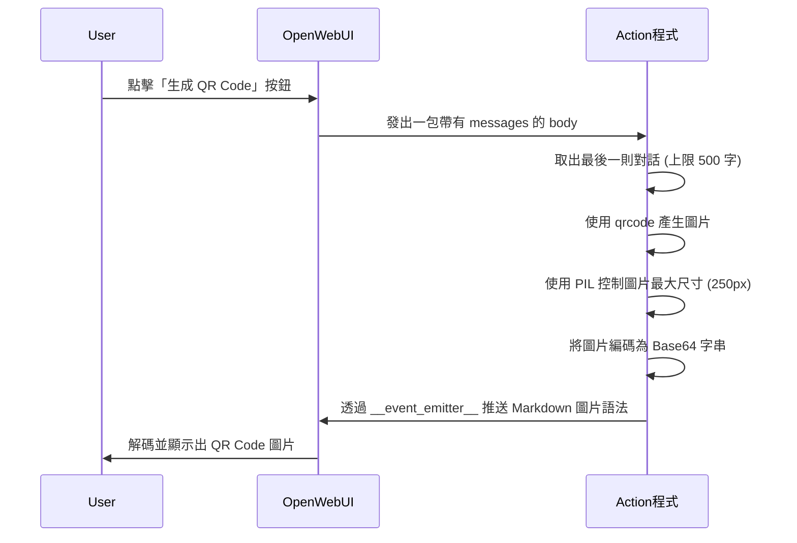

# 生成 QR Code

> 🔲 視覺化很震撼

```python
"""
title: Generate QR Code
author: Your Name
version: 0.1.0
requirements: qrcode[pil], pydantic
"""

from pydantic import BaseModel
import qrcode
import base64
from io import BytesIO
from typing import Optional
from PIL import Image

class Action:
    class Valves(BaseModel):
        size: int = 10

    def __init__(self):
        self.valves = self.Valves()

    async def action(
        self,
        body: dict,
        __user__=None,
        __event_emitter__=None,
        __event_call__=None,
    ) -> Optional[dict]:
        """將訊息文字編碼為 QR Code 圖片"""

        messages = body.get("messages", [])
        if not messages:
            return {"status": "empty"}
            
        last_message = messages[-1]
        message_content = last_message.get("content", "")[:500]  # QR 有大小限制

        if not message_content:
            return {"status": "empty"}

        try:
            # 生成 QR Code
            qr = qrcode.QRCode(box_size=self.valves.size)
            qr.add_data(message_content)
            qr.make()

            # 將 QR Code 轉為可編輯的 PIL Image
            img = qr.make_image().convert("RGB")

            # 在這裡用程式強制縮放圖片限制大小 (最大寬度 250px)
            max_size = 250
            if img.size[0] > max_size:
                ratio = max_size / float(img.size[0])
                new_size = (max_size, int(float(img.size[1]) * ratio))
                # 使用 Image.NEAREST 確保點陣不會變模糊
                img = img.resize(new_size, Image.NEAREST)

            # 轉成 Base64
            buffer = BytesIO()
            img.save(buffer, format="PNG")
            img_base64 = base64.b64encode(buffer.getvalue()).decode()

            if __event_emitter__:
                await __event_emitter__(
                    {
                        "type": "message",
                        # 改回標準的 Markdown 圖片語法，因為 OpenWebUI 會將 HTML 標籤轉譯成文字
                        "data": {"content": f"✅ QR Code 已生成！\n\n"},
                    }
                )

        except Exception as e:
            if __event_emitter__:
                await __event_emitter__(
                    {"type": "message", "data": {"content": f"❌ 生成失敗: {str(e)}"}}
                )

        return {"status": "completed"}

```
<details>
<summary>💡 程式碼說明和workflow</summary>

## 📋 程式概述
這個 Action 示範了當使用者點擊按鈕時，如何**攔截最後一則對話進行加工**，並利用 `__event_emitter__` 將加工後的結果（Base64 圖片）即時回傳顯示在畫面上，而不需要重整網頁。

---

## 🔄 Workflow 流程圖



---

## 📝 關鍵技術詳解

### 1. 安全提取對話
```python
messages = body.get("messages", [])
if not messages:
    return {"status": "empty"}
    
last_message = messages[-1]
message_content = last_message.get("content", "")[:500] 
```
由於 OpenWebUI 傳入的 `body` 是一整個對話陣列，我們必須取得 `messages[-1]` 才能正確獲取使用者觸發 Action 當下的對話。另外，由於 QR Code 對字元容載量有極限，因此利用 `[:500]` 強制裁斷超過 500 字的部分以防報錯。

### 2. 強制縮放圖片大小 (PIL)
```python
max_size = 250
if img.size[0] > max_size:
    ratio = max_size / float(img.size[0])
    new_size = (max_size, int(float(img.size[1]) * ratio))
    img = img.resize(new_size, Image.NEAREST)
```
當文字極長時生成的 QR 圖片會非常龐大。由於 OpenWebUI 會對前端輸出的 HTML `` 進行安全防護轉譯為字串，導致我們無法用 HTML 屬性控制大小。因此最安全的做法是：**直接在後端用 Python 的 PIL 套件把原始圖片變小**。這裡使用 `Image.NEAREST` (最近鄰插值法) 來縮放，以確保黑白分明的邊緣不會被抗鋸齒運算變得模糊而掃不出來。

### 3. Base64 轉換與即時推播
```python
buffer = BytesIO()
img.save(buffer, format="PNG")
img_base64 = base64.b64encode(buffer.getvalue()).decode()

await __event_emitter__(
    {
        "type": "message",
        "data": {"content": f"✅ QR Code 已生成！\n\n"},
    }
)
```
- **Base64**：讓二進位的圖片檔案能夠轉變成純文字，並直接內嵌到 Markdown 語法裡（不需產生實體檔案佔用系統硬碟）。
- **即時推播**：利用 `__event_emitter__` 並指定 `type: "message"`，可以直接在對話視窗上打出訊息與這張圖片，讓學生可以感受到立竿見影的反饋！

</details>