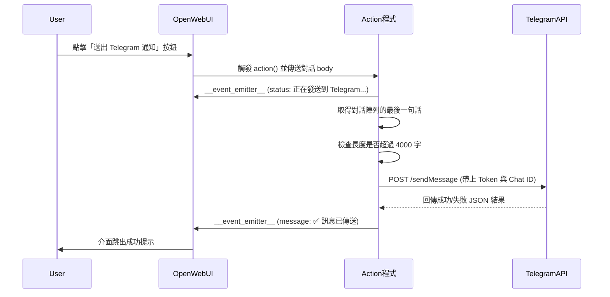

# 送出 Telegram 通知

> 🔔 展示外部 API 整合 (Webhook / Bot 串接)
> 相比 Slack，Telegram Bot 申請極為簡單，非常適合個人推播使用！

## Telegram 申請與設定

比起申請 Slack Webhook，Telegram 的這項功能「**完全免費**、**申請極速**、**而且永遠不會過期**」，所以非常推薦做為串接教學的第一站！

### 🤖 申請與設定三步圖解：
1. **取得 Token**：點擊左上角的 **Search (搜尋列)**，尋找 `@BotFather` (官方爸爸)，點擊 Start 後輸入 `/newbot` 建立機器人。依照指示取個好名字後，系統就會噴給您長長一串的 `HTTP API Token`。
2. **取得 Chat ID (您的專屬帳號數字)**：
   - 這裡的 Chat ID 其實就是您個人的 Telegram 帳號 ID，並不需要特別建立群組！
   - 請**再次點擊左上角的搜尋列**，搜尋 `@userinfobot` (🌟 絕對不要把它當成訊息傳給別人喔！要在搜尋列找)。找到並進入後點擊下方的 Start，它馬上會吐出 `Id: 123456789`，這串數字就是 Chat ID。
3. **⚠️ 關鍵防呆機制 (絕對要執行)**：因為 Telegram 規定機器人不能主動密人（防翻群機制），所以您必須**第三次回到左上角搜尋列**，搜尋您在第一步建立的機器人名稱，進入對話框並**點擊最下方的 [Start] 按鈕**！做完這步它才擁有把訊息發給您的權限！
4. **填入設定 (Valves)**：回到 Open WebUI，將剛剛獲得的 `Token` 與 `Chat ID` 貼到這個 Action 的 Valves (管理介面的設定齒輪) 欄位中，立刻就可以一鍵把重要的對話總結傳進自己的手機裡！

```python
"""
title: Send to Telegram
author: Your Name
version: 0.1.0
requirements: requests, pydantic
"""

from pydantic import BaseModel, Field
from typing import Optional
import requests

class Action:
    class Valves(BaseModel):
        bot_token: str = Field(
            default="",
            description="Telegram Bot Token (從 @BotFather 取得)"
        )
        chat_id: str = Field(
            default="",
            description="你的 Telegram Chat ID (可向 @userinfobot 查詢)"
        )

    def __init__(self):
        self.valves = self.Valves()

    async def action(
        self,
        body: dict,
        __user__=None,
        __event_emitter__=None,
        __event_call__=None,
    ) -> Optional[dict]:
        """將訊息發送到 Telegram"""
        
        # 安全取得最後一句對話
        messages = body.get("messages", [])
        if not messages:
            return {"status": "empty"}
            
        last_message = messages[-1]
        message_content = last_message.get("content", "")
        
        if not self.valves.bot_token or not self.valves.chat_id:
            if __event_emitter__:
                await __event_emitter__({
                    "type": "message",
                    "data": {
                        "content": "❌ 未設定 Telegram 機器人 Token 或 Chat ID"
                    }
                })
            return {"status": "failed"}
        
        if __event_emitter__:
            await __event_emitter__({
                "type": "status",
                "data": {
                    "description": "正在發送到 Telegram...",
                    "done": False
                }
            })
        
        try:
            # Telegram Bot API URL
            api_url = f"https://api.telegram.org/bot{self.valves.bot_token}/sendMessage"
            
            # 確保訊息不會超過 Telegram 的 4096 字元上限
            if len(message_content) > 4000:
                message_content = message_content[:4000] + "...\n\n(❗️字數過長，已截斷)"
            
            # 加入發送者名稱提示
            sender = __user__.get("name", "一般使用者") if __user__ else "使用者"
            formatted_msg = f"🔔 來自【{sender}】的備忘錄:\n\n{message_content}"
            
            payload = {
                "chat_id": self.valves.chat_id,
                "text": formatted_msg
                # ⚠️ 這裡刻意不使用 "parse_mode": "Markdown" 
                # 因為 AI 產生的內容常有未閉合的星號、底線等特殊符號，會導致 Telegram 解析失敗報錯
            }
            
            response = requests.post(api_url, json=payload, timeout=10)
            result = response.json()
            
            if __event_emitter__:
                if response.status_code == 200 and result.get("ok"):
                    await __event_emitter__({
                        "type": "message",
                        "data": {
                            "content": "✅ 訊息已經用小飛機 ✈️ 發送到 Telegram 囉！"
                        }
                    })
                else:
                    await __event_emitter__({
                        "type": "message",
                        "data": {
                            "content": f"❌ Telegram 發送失敗: {result.get('description', '未知錯誤')}"
                        }
                    })
        except Exception as e:
            if __event_emitter__:
                await __event_emitter__({
                    "type": "message",
                    "data": {
                        "content": f"❌ 系統發生錯誤: {str(e)}"
                    }
                })
        
        return {"status": "completed"}
```
<details>
<summary>💡 程式碼說明和工作流程</summary>

## 📋 程式概述
這個 Action 示範了當使用者點擊按鈕後，如何萃取當前的最後一則對話，並利用 Python 的 `requests` 套件，將文字透過 Telegram Bot API 傳送到個人的手機中。整個過程也利用 `__event_emitter__` 來達成前端的狀態推播。

---

## 🔄 Workflow 流程圖



---

## 📝 關鍵技術與防呆詳解

### 1. Valves 的環境變數注入
```python
class Valves(BaseModel):
    bot_token: str = Field(default="")
    chat_id: str = Field(default="")
```
將 API Token 與 Chat ID 寫成 Valves 的好處是，**您（或其它使用者）不需要硬改 Python 程式碼**。任何不懂程式的人拿到這隻腳本，只要在網頁後台填入自己的 Token，就能馬上讓這隻功能生效。

### 2. 關於 Telegram 的兩個隱形大坑 (文字處理)
```python
# 坑一：字數過長會被 Telegram 拒絕
if len(message_content) > 4000:
    message_content = message_content[:4000] + "...\n\n(❗️字數過長，已截斷)"

# 坑二：刻意不使用 parse_mode (Markdown)
payload = {
    "chat_id": self.valves.chat_id,
    "text": formatted_msg
}
```
- **字數限制**：Telegram API 一次推播的最大長度大約是 4096 個字元。因為 AI 返回的總結很容易超長，如果不利用 `[:4000]` 先強制截斷，這個 API 就會直接報錯死掉。
- **Markdown 解析崩潰**：初學者很常加上 `"parse_mode": "Markdown"` 想讓字體變粗。但 AI 產生的原始文字常常有「未成對閉合」的星號 `**` 或底線 `_`。只要少一個閉合符號，Telegram 就會噴出 `can't parse entities` 的錯誤。**保持純文字發送**是最安全、最暴力的防呆解法。

### 3. 一邊做一邊回報進度 (`__event_emitter__`)
在這部腳本中我們兩次呼叫了 `__event_emitter__`：
1. **傳送前** (`type: status`)：在畫面右下角轉圈圈，顯示「正在發送到 Telegram...」，安撫使用者的等待焦慮。
2. **傳送後** (`type: message`)：收到 HTTP 200 OK 之後，直接把「✅ 成功送出」寫到聊天室畫面上，給予使用者最直接的正向回饋。

</details>

