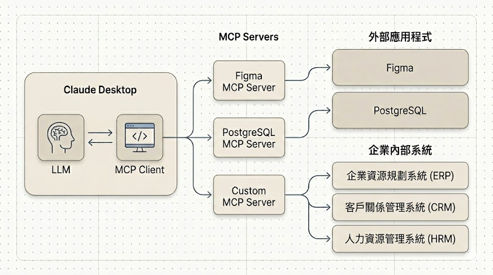

# MCP

## 名詞解釋：什麼是「MCP」？

**MCP（Model Context Protocol）** 是一種協定，用於在模型和外部工具之間傳遞上下文。它讓 LLM 可以標準化地呼叫外部 API、查詢資料庫、存取本地檔案等。

---

## 注意:OpenWebUI 沒有MCP Client的功能

## 📋 目錄

### 第一篇：使用現有 MCP（環境建置與入門）

| 順序 | 主題 | 說明 |
|------|------|------|
| 1 | [open-webui如何使用MCP](./open-webui如何使用MCP.md) | MCP 工具在 Open-WebUI 的啟用與基本使用 |
| 2 | [使用Dockerfile建立MCPO](./使用Dockerfile建立MCPO.md) | 建立 mcpo 映像與容器 |
| 3 | [使用docker_compose整合Dockerfile](./使用docker_compose整合Dockerfile.md) | 以 docker-compose 管理 MCP 服務 |
| 4 | [整合使用open-webui和cloudflare tunnel](./整合使用open-webui和cloudflare_tunnel.md) | 透過 Cloudflare Tunnel 對外曝光 |
| 5 | [同時安裝多個MCP Server](./同時安裝多個MCP_Server.md) | 部署多個 MCP 工具（時間、天氣等） |

---

### 第二篇：自訂 MCP Server

| 階段 | 主題 | 說明 |
|------|------|------|
| 0 | [認識 FastMCP](./自訂MCP_00_認識FastMCP.md) | 什麼是 FastMCP、MCP 協定、與 Pipeline 的差異 |
| 1 | [撰寫第一個自訂工具](./自訂MCP_01_第一個自訂工具.md) | FastMCP 入門、`hello`、`add` 等靜態工具 |
| 2 | [呼叫外部 API](./自訂MCP_02_呼叫外部API.md) | `get_weather` 天氣查詢、錯誤處理、API Key 管理 |
| 3 | [整合資料庫](./自訂MCP_03_整合資料庫.md) | PostgreSQL 查詢、COVID-19 資料、mcpo-sql 範例 |
| 4 | [整合 mcpo 部署](./自訂MCP_04_整合mcpo部署.md) | docker-compose 設定、volume 掛載、Open-WebUI 連線驗證 |

---

### 實作範例

| 範例 | 對應章節 | 說明 |
|------|----------|------|
| [mcp-custom](./實作範例/mcp-custom) | 自訂 MCP 01 | 第一個自訂工具（hello、add） |
| [mcpo-api](./實作範例/mcpo-api) | 自訂 MCP 02 | 天氣查詢（Open-Meteo API） |
| [mcpo-sql](./實作範例/mcpo-sql) | 自訂 MCP 03 | COVID-19 資料查詢（PostgreSQL） |

---

### 參考文件

| 文件 | 說明 |
|------|------|
| [MCP Server 架構規劃](./MCP_Server_架構規劃.md) | 整體架構概覽、專案結構、部署模式、教學階段規劃 |
