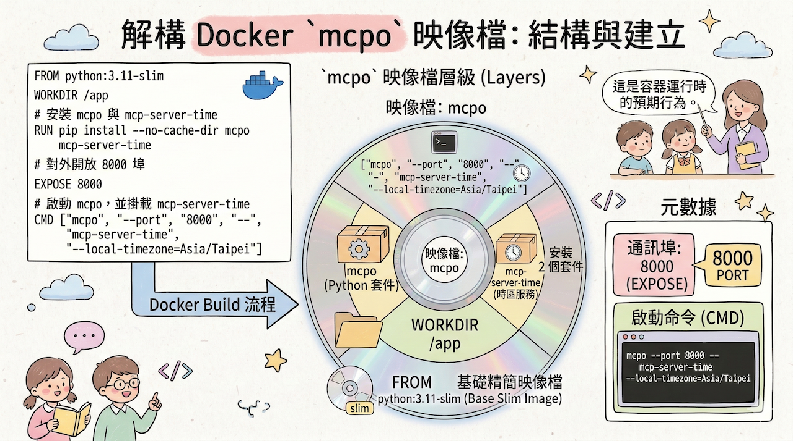

# 使用 Dockerfile 建立 MCPO 工具伺服器

## 📋 目錄

- [為什麼要用 Dockerfile？](#為什麼要用-dockerfile)
- [一、撰寫 Dockerfile](#一撰寫-dockerfile)
- [二、建置 Image](#二建置-image)
- [三、執行 Container](#三執行-container)

---

## 前言：從 docker run 到 Dockerfile

若你曾經用以下指令啟動 mcpo：

```bash
docker run -d \
  --name mcpo \
  --network webui-net \
  -p 8000:8000 \
  python:3.11 \
  sh -c "pip install --no-cache-dir mcpo mcp-server-time && \
         mcpo --port 8000 -- mcp-server-time --local-timezone=Asia/Taipei"
```

這段指令其實做了三件事：

1. 使用 `python:3.11` 作為基礎映像
2. 在容器啟動時安裝 `mcpo` 與 `mcp-server-time`
3. 啟動 mcpo，並掛載 `mcp-server-time` 作為 MCP Server

接下來我們把它改寫成 **Dockerfile** 的方式，方便版本控制與重複建置。

---

## 為什麼要用 Dockerfile？

| docker run | Dockerfile |
|------------|------------|
| 一次性執行，難以重現 | 可版本控制（如 Git） |
| 無法重建相同環境 | 可重複建置相同映像 |
| 指令長、不易閱讀 | 架構清晰，步驟分明 |
| 難以維護與分享 | 可上傳 GitHub，方便協作 |



---

## 一、撰寫 Dockerfile

## Dockerfile使用方法說明,請參考下面連結:

[Dockerfile使用方法說明](../../Docker/DockerFile說明.md)

### 步驟 1：建立專案目錄

建立一個資料夾，例如：

```
mcpo-server/
 └── Dockerfile
```

### 步驟 2：撰寫 Dockerfile 內容

```dockerfile
FROM python:3.11-slim

WORKDIR /app

# 安裝 mcpo 與 mcp-server-time
RUN pip install --no-cache-dir mcpo mcp-server-time

# 對外開放 8000 埠
EXPOSE 8000

# 啟動 mcpo，並掛載 mcp-server-time
CMD ["mcpo", "--port", "8000", "--", "mcp-server-time", "--local-timezone=Asia/Taipei"]
```

**說明：**

- `python:3.11-slim` 比 `python:3.11` 體積更小，適合部署
- `EXPOSE 8000` 標示此映像使用 8000 埠
- `CMD` 使用 JSON 陣列格式，為 Docker 推薦的寫法

---

## 二、建置 Image

在 `mcpo-server` 目錄下執行：

```bash
docker build -t mcpo-server .
```

**參數說明：**

| 參數 | 說明 |
|------|------|
| `-t mcpo-server` | 指定映像名稱為 `mcpo-server` |
| `.` | 指定 Dockerfile 所在目錄（當前目錄） |

---

## 三、執行 Container

### 步驟 1：確認網路存在

確認 `webui-net` 網路是否存在（Open-WebUI 通常會建立此網路）：

```bash
docker network ls
```

若沒有 `webui-net`，請手動建立：

```bash
docker network create webui-net
```

### 步驟 2：啟動容器

```bash
docker run -d \
  --name mcpo \
  --network webui-net \
  -p 8000:8000 \
  mcpo-server
```

### 步驟 3：確認服務正常

**檢查容器狀態：**

```bash
docker ps
```

### 使用docker exec 驗証是否有建立/app目錄

```bash
docker exec -it mcpo /bin/bash
```

```bash
ls /app
```

**使用瀏覽器驗證：**

開啟 `http://<樹莓派IP>:8000/docs`，應能看到 Swagger UI 介面及 `/get_current_time`、`/convert_time` 兩個 endpoint。

---
