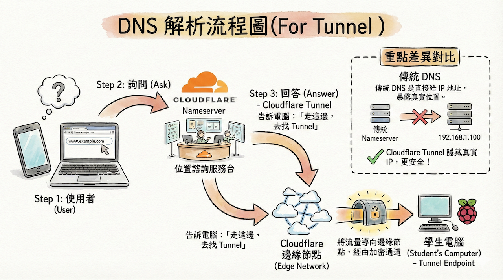
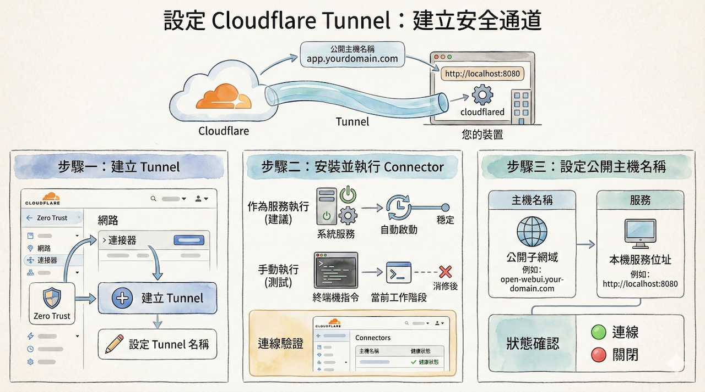

# Cloudflare Tunnel

## 目錄

- [前置作業：設定個人網域](#前置作業設定個人網域)
  - [步驟一：註冊網域並更新名稱伺服器](#步驟一註冊網域並更新名稱伺服器)
  - [步驟二：驗證網域設定](#步驟二驗證網域設定)
- [設定 Cloudflare Tunnel](#設定-cloudflare-tunnel)
- [步驟一：建立 Tunnel](#步驟一建立-tunnel)
  - [1. 進入 Cloudflare Zero Trust 儀表板](#1-進入-cloudflare-zero-trust-儀表板)
  - [2. 選擇通道類型](#2-選擇通道類型)
  - [3. 為通道命名](#3-為通道命名)
  - [4. 選擇執行環境](#4-選擇執行環境建議先在raspberry-pi-os上測試最後再至docker上測試)
  - [5. 安裝 cloudflared 應用程式](#5-安裝-cloudflared-應用程式)
  - [6. （建議）測試與服務安裝](#6-建議測試與服務安裝)
  - [7. 確認連線狀態](#7-確認連線狀態)
  - [8. 進入下一步](#8-進入下一步)
- [步驟二：整合自己的 DNS（將網域指向 Tunnel）](#步驟二整合自己的-dns將網域指向-tunnel)
  - [9. 進入 DNS 整合設定](#9-進入-dns-整合設定)
  - [10. 選擇應用程式類型](#10-選擇應用程式類型)
  - [11. 設定主機名稱（Hostname）](#11-設定主機名稱hostname)
  - [12. （選擇性）設定路徑（Path）](#12-選擇性設定路徑path)
  - [13. 設定服務（Service）](#13-設定服務service)
  - [14. （進階）其他應用程式設定](#14-進階其他應用程式設定)
  - [15. 完成設定](#15-完成設定)
  - [16. 驗證設定結果](#16-驗證設定結果)
- [完成設定](#完成設定)
  - [檢查連線狀態](#檢查連線狀態)
- [使用 Docker 來設定 Cloudflare Tunnel](#使用-docker-來設定-cloudflare-tunnel)
  - [步驟一：部署 Open WebUI 容器](#步驟一部署-open-webui-容器)
  - [步驟二：部署 Cloudflare Tunnel 容器(使用docker run指令)](#步驟二部署-cloudflare-tunnel-容器使用docker-run指令)
    - [⚠️ 重要提醒](#️-重要提醒)
    - [Cloudflare 官方建議的指令（會出錯）](#cloudflare-官方建議的指令會出錯)
    - [為什麼會出錯？](#為什麼會出錯)
    - [✅ 正確的 Docker 指令](#-正確的-docker-指令)
    - [指令說明](#指令說明)
  - [步驟三：使用 Docker Compose 部署（進階方式）](#步驟三使用-docker-compose-部署進階方式)
    - [一、對照概念（建立正確心智模型）](#一對照概念建立正確心智模型)
    - [二、建立 docker-compose.yml](#二建立-docker-composeyml)
    - [三、啟動與管理方式](#三啟動與管理方式)
    - [四、為什麼一定要使用 network_mode: host？](#四為什麼一定要使用-network_mode-host)
    - [五、Cloudflare Tunnel 與 Open WebUI 的關係圖](#五cloudflare-tunnel-與-open-webui-的關係圖)
    - [六、進階優化建議（選用）](#六進階優化建議選用)
    - [七、故障排查](#七故障排查)

---

Cloudflare Tunnel 是一種能夠安全地將您的內部服務連接到 Cloudflare 全球網路的工具，而無需對外暴露公開的 IP 位址。它透過在您的伺服器上運行的輕量級代理程式 `cloudflared`，建立一個僅限對外的安全連線，讓內外部流量可以雙向傳輸。

## 前置作業：設定個人網域

> 核心觀念：**一旦將網域的名稱伺服器 (Nameserver) 指向 Cloudflare，DNS 的管理權限即由 Cloudflare 接管，而非原註冊商（如 GoDaddy）。**


### 步驟一：註冊網域並更新名稱伺服器

1.  **註冊網域**：於網域註冊商（如 [GoDaddy](https://godaddy.com)）申請一個個人網域。
2.  **新增網站至 Cloudflare**：登入 [Cloudflare](https://cloudflare.com)，將您剛申請的網域新增為一個站點。進入該站點的 DNS 設定頁面，Cloudflare 會提供兩組專屬的名稱伺服器 (Nameserver) 位址。
3.  **更新名稱伺服器**：回到 GoDaddy 的 DNS 管理頁面，找到「名稱伺服器 (Nameservers)」設定，將其從 GoDaddy 預設值更改為 Cloudflare 提供的那兩組位址。

### 步驟二：驗證網域設定

您可以透過以下任一方式，確認您的網域是否已成功交由 Cloudflare 管理。

**圖形化介面 (GUI) 驗證**

1.  登入 Cloudflare，檢查您網域專案的狀態是否顯示為 **`使用中 (Active)`**。
2.  導覽至專案內的 **`DNS > 記錄 (Records)`** 頁面，確認您有權限新增或編輯 DNS 記錄。

**命令列介面 (CLI) 驗證**

您可以使用 `nslookup` 或 `dig` 等 DNS 查詢工具。若您的系統（如 Raspberry Pi）尚未安裝，請執行以下指令：
```bash
sudo apt update
sudo apt install dnsutils
```

接著，查詢您網域的 NS (Name Server) 記錄：
```bash
# 使用 nslookup
nslookup -type=NS your-domain.com

# 或使用 dig
dig NS your-domain.com
```
如果回傳的結果是 Cloudflare 提供的那兩組伺服器位址，即代表設定正確。



> **相關資源**：[Cloudflare Tunnel 簡報檔下載](./Cloudflare_Tunnel_Guide.pptx)

## 設定 Cloudflare Tunnel


**Tunnel vs 傳統的port Forwarding的關念圖**

> [Tunnel vs 傳統的port Forwarding的關念圖](./images/tunnel_portForwarding.png)


> 核心觀念：**建立一個 Tunnel 通道，並在您的裝置上執行 `cloudflared` 程式來連接它。接著，設定一個公開的主機名稱 (例如 `app.yourdomain.com`)，並將其對應到您本機的服務 (例如 `http://localhost:8080`)。**



## 步驟一：建立 Tunnel

### 1. 進入 Cloudflare Zero Trust 儀表板

1. 在 Cloudflare 儀表板中，導覽至 **`Zero Trust`**。
2. 在左側選單中，選擇 **`網路 (Network) > 連接器`**。
3. 點擊 **`建立 Tunnel (Create a Tunnel)`**。

### 2. 選擇通道類型

* 通道類型選擇 **Cloudflared**

  > Cloudflared 是 Cloudflare 提供的官方連接器，用來在本機與 Cloudflare 之間建立安全通道。

### 3. 為通道命名

* 輸入通道名稱，例如：`web`、`app`、`n8n`
* 此名稱僅用於管理與識別，不影響實際對外網址。

### 4. 選擇執行環境(建議先在Raspberry Pi OS上測試,最後再至Docker上測試)

* 依實際主機作業系統選擇，例如：**Debian**、**Ubuntu**、**Raspberry Pi OS**

### 5. 安裝 cloudflared 應用程式

* 依照 Cloudflare 提供的指令，在終端機中下載並安裝 `cloudflared`
* 安裝完成後，即可使用 `cloudflared` 指令

### 6. （建議）測試與服務安裝

* 可先手動執行 Tunnel，確認可正常連線
* 接著可將 `cloudflared` 安裝成系統服務（service），讓電腦或伺服器開機時自動啟動 Tunnel

### 7. 確認連線狀態

* 回到 Dashboard 確認連線狀態
* 若連線成功，下方 **Connectors** 區域會顯示該主機為 **已連線（Connected）**

### 8. 進入下一步

* 確認無誤後，點選 **「下一步（Next）」**

---

## 步驟二：整合自己的 DNS（將網域指向 Tunnel）

### 9. 進入 DNS 整合設定

* 進入 **整合 DNS（Route Tunnel / Publish Application）** 步驟
* 此步驟的目的，是將自己的網域名稱（DNS）指向剛建立的 Tunnel。

### 10. 選擇應用程式類型

* 選擇 **為 Web 新增已發佈的應用程式路由**

  > 代表透過 Tunnel，將外部網域的請求安全地轉送到內部服務。

### 11. 設定主機名稱（Hostname）

* **子網域（Subdomain）**：
  * 例如：`www`、`app`、`n8n`
* **網域（Domain）**：
  * 選擇已加入 Cloudflare 並由其管理 DNS 的網域
* 組合後的對外網址例如：

  ```
  app.example.com
  ```

### 12. （選擇性）設定路徑（Path）

* 若只想讓特定路徑走此 Tunnel，可設定如：

  ```
  /api
  ```

* 若整個網站或服務都使用 Tunnel，可留空。

### 13. 設定服務（Service）

* **類型（Type）**：
  * 通常選擇 `HTTP` 或 `HTTPS`
* **URL**：
  * 輸入內部服務位址，例如：

    ```
    http://localhost:3000
    ```

    或

    ```
    http://127.0.0.1:5678
    ```

### 14. （進階）其他應用程式設定

* 可依需求調整逾時、HTTP Host Header、TLS 等進階選項
* 教學或初學情境可先維持預設值。

### 15. 完成設定

* 點選 **「完成設定（Finish）」**
* Cloudflare 會自動建立對應的 DNS 紀錄，並將流量導向 Tunnel。

### 16. 驗證設定結果

* 在瀏覽器輸入設定的網域名稱
* 若內部服務畫面可正常顯示，表示：
  * DNS 設定成功
  * Tunnel 連線成功
  * 本機服務運作正常

---

## 完成設定


### 檢查連線狀態

之後，您可以在 Cloudflare 的 Tunnel 設定頁面，透過 **通道名稱** 區塊的狀態來判斷連線是否成功：

* 正常連線時會顯示 **`連線`**
* 若中斷則會顯示 **`關閉`**

---

## 使用 Docker 來設定 Cloudflare Tunnel

本節說明如何在 Docker 環境中設定 Cloudflare Tunnel，適用於已使用 Docker 部署服務的場景。

### 步驟一：部署 Open WebUI 容器

首先，建立 Open WebUI 服務容器：

```docker
docker run -d \
  --network=host \
  -v open-webui:/app/backend/data \
  -e OLLAMA_BASE_URL=http://127.0.0.1:11434 \
  --name open-webui \
  --restart always \
  ghcr.io/open-webui/open-webui:main
```

### 步驟二：部署 Cloudflare Tunnel 容器(使用docker run指令)

#### ⚠️ 重要提醒

**請勿直接使用 Cloudflare 官方文件建議的 Docker 指令**，否則會出現連線問題。

#### Cloudflare 官方建議的指令（會出錯）

```docker
docker run cloudflare/cloudflared:latest tunnel --no-autoupdate run --token <TOKEN>
```

#### 為什麼會出錯？

此指令缺少以下關鍵參數，會導致問題：

1. **缺少 `--network=host` 參數**
   * 導致容器無法正常連線到本機服務（如 `localhost:3000`）
   * Tunnel 無法將外部請求轉送到內部服務

2. **缺少 `-d` 參數**
   * 容器以前景模式執行，終端機關閉後容器也會停止
   * 無法在背景持續運行

#### ✅ 正確的 Docker 指令

使用以下指令可確保 Tunnel 正常運作：

```docker
docker run -d \
  --name cloudflared \
  --network=host \
  --restart unless-stopped \
  cloudflare/cloudflared:latest \
  tunnel run --token <TOKEN>
```

#### 指令說明

* `-d`：以後台模式執行容器
* `--name cloudflared`：為容器命名，方便管理
* `--network=host`：使用主機網路模式，讓容器可以直接存取 `localhost` 服務
* `--restart unless-stopped`：設定容器自動重啟策略
* `<TOKEN>`：替換為您在 Cloudflare Dashboard 中取得的 Tunnel Token

### 步驟三：使用 Docker Compose 部署（進階方式）

如果您希望使用 Docker Compose 來管理多個容器，可以使用以下方式統一部署 Open WebUI 和 Cloudflare Tunnel。

#### 一、對照概念（建立正確心智模型）

您目前的部署狀況：

* **open-webui**
  * 使用 `--network=host`
  * 直接連線到 Raspberry Pi 的 `127.0.0.1:11434`（Ollama）
* **cloudflared**
  * 也使用 `--network=host`
  * Tunnel 指向 Raspberry Pi 本機服務（例如 open-webui 的 port）

👉 **所以在 docker-compose.yml 裡：**

* 兩個 service **都必須使用** `network_mode: host`
* **不能使用** `ports` 映射
* **不能使用** 自訂 docker network

---

#### 二、建立 docker-compose.yml

請在任意資料夾建立一個檔案：

```
docker-compose.yml
```

內容如下（可直接使用）：

```yaml
version: "3.9"

services:
  open-webui:
    image: ghcr.io/open-webui/open-webui:main
    container_name: open-webui
    restart: always
    network_mode: host
    volumes:
      - open-webui:/app/backend/data
    environment:
      OLLAMA_BASE_URL: http://127.0.0.1:11434

  cloudflared:
    image: cloudflare/cloudflared:latest
    container_name: cloudflared
    restart: unless-stopped
    network_mode: host
    command: tunnel run --token <TOKEN>

volumes:
  open-webui:
```

📌 **這個 compose 檔案的功能，與您原本的兩個 `docker run` 指令完全等價**

---

#### 三、啟動與管理方式

**啟動服務：**

```bash
docker compose up -d
```

**檢查容器狀態：**

```bash
docker compose ps
```

**查看日誌（非常重要，用於排查問題）：**

```bash
docker compose logs -f cloudflared
```

---

#### 四、為什麼一定要使用 network_mode: host？

在 Raspberry Pi 上的網路架構：

| 容器 | 您期待的 localhost |
|------|-------------------|
| open-webui | Pi 的 localhost |
| cloudflared | Pi 的 localhost |
| ollama | Pi 的 localhost |

**只要三者需要共用 `127.0.0.1`，就一定要使用 `network_mode: host`**

❌ **如果改成 bridge network：**

* `127.0.0.1` 會變成「容器自己」
* cloudflared 會找不到 open-webui
* open-webui 會找不到 ollama

---

#### 五、Cloudflare Tunnel 與 Open WebUI 的關係圖

```
[ Internet ]
     │
     ▼
Cloudflare Tunnel
     │  (cloudflared container)
     ▼
Raspberry Pi localhost
     │
     ├── Open WebUI : http://127.0.0.1:3000
     └── Ollama     : http://127.0.0.1:11434
```

👉 **重要觀念：**

* Tunnel **不是連 Docker 容器**
* Tunnel **是連 Pi 本機服務**

---

#### 六、進階優化建議（選用）

等您熟悉基本操作後，可以考慮以下優化：

**1. 使用環境變數檔案（.env）管理 Token**

建立 `.env` 檔案：

```
CLOUDFLARE_TOKEN=xxxxx
```

在 `docker-compose.yml` 中使用：

```yaml
command: tunnel run --token ${CLOUDFLARE_TOKEN}
```

**2. 固定服務端口**

如果未來不使用 host network，可以為 open-webui 固定端口。

**3. 添加依賴關係**

雖然 host network 模式下不強制，但可以加上 `depends_on` 來確保啟動順序。

---

#### 七、故障排查

如果設定完成後仍然無法連線，請提供以下資訊以便診斷：

* `docker compose ps` 的輸出結果
* `docker compose logs cloudflared` 的日誌內容
* 您在 Cloudflare Tunnel 設定的 **Public Hostname → Service URL**

根據這些資訊，可以精準判斷問題出在哪一層：
* DNS 設定
* Tunnel 連線
* Container 運行狀態
* localhost 服務