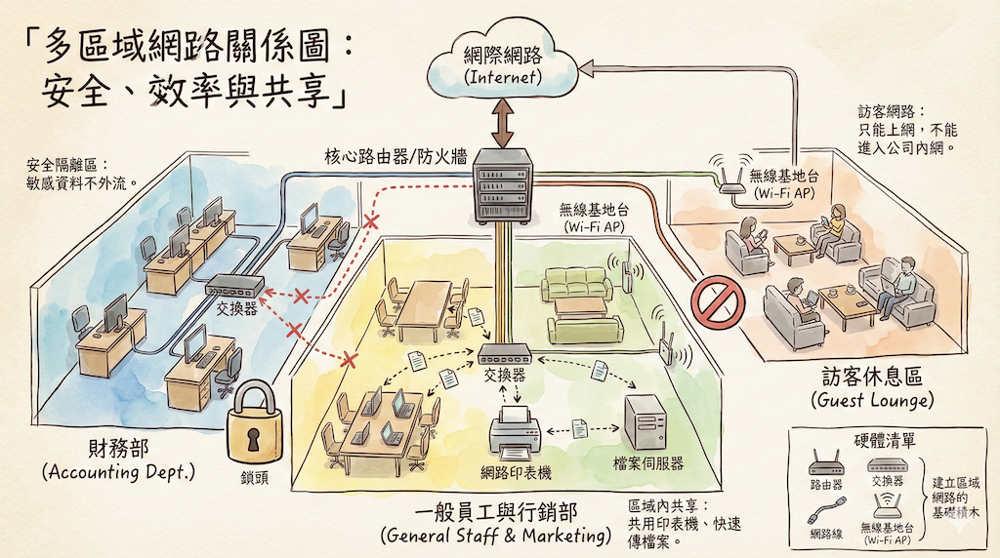

# 區域網路
簡單來說，區域網路就是在一個小範圍內（例如一間辦公室、學校或家庭）將多台電腦和其他設備連接起來的私人網路。

主要優點有：
*   **資源共享**：讓大家可以共用印表機、掃描器或檔案，不需要每台電腦都買一套，能節省成本。
*   **協同合作**：方便團隊成員快速傳輸檔案、共同編輯文件，提升工作效率。
*   **集中管理**：管理者可以統一設定、更新及備份所有連線的電腦，也更容易進行遠端控制。

在教學上，老師可以利用區域網路快速分發教材給所有學生，並統一管理學生的電腦環境。

**區域網路說明圖**

**說明**

**「為什麼我們要把網路切分成好幾個區域？」** 以及 **「不同的區域各自負責什麼任務？」**。

網路規劃就像是蓋房子隔間一樣，是為了**安全**與**效率**。

---

### 1. 網路的總大門：核心路由器/防火牆 (Top Center)

* **位置：** 圖中最上方連接著雲朵 (Internet) 的那台黑色機器。
* **角色：** 它是公司的**總警衛室**。
* **重點說明：** 所有的資料要進出公司，都必須經過這裡。它負責分配流量，並決定誰可以去哪裡（比如它允許訪客上網，但禁止訪客進入財務部）。

### 2. 藍色區域：財務部 (左側 - 安全至上)

* **重點概念：** **「隔離 (Isolation)」**。
* **為什麼這樣設計？**
* 財務資料（薪水、報表）是最敏感的。
* 圖中的 **「虛線紅叉」** 代表這是一個封閉的小圈圈，外面的訪客或一般員工不能隨意連進來。
* 這裡的電腦透過**有線網路 (交換器 Switch)** 連接，比無線更穩定且難以被竊聽。

### 3. 黃色區域：一般員工區 (中間 - 資源共享)

* **重點概念：** **「區域網路內的共享 (LAN Sharing)」**。
* **在這裡可以做什麼？**
* **共用印表機：** 你不用走到印表機旁邊插線，透過網路就能列印。
* **檔案伺服器 (NAS)：** 大家把檔案丟進那個盒子裡，同事就能直接抓取，不用拿隨身碟傳來傳去。
* **Wi-Fi 與有線並存：** 筆電和手機可以靈活移動，同時享受內網資源。

### 4. 橘紅區域：訪客休息區 (右側 - 權限限制)

* **重點概念：** **「訪客網路 (Guest Network)」**。
* **為什麼這樣設計？**
* 客人來公司喝咖啡、開會，需要上網查資料（連線到 Internet）。
* 但為了安全，我們**絕對不能**讓客人的手機連到公司的印表機或財務電腦。
* 那個 **Stop 標誌** 就是防火牆立下的規矩：「只准往外跑 (上網)，不准往內鑽」。

### 5. 右下角：建立網路的基礎積木 (Hardware Checklist)

要搭建出這樣的網路，我們需要認識這幾種「樂高積木」：

* **路由器 (Router):** 指揮交通，決定資料往哪走。
* **交換器 (Switch):** 像是延長線插座，讓很多台電腦可以串在一起變成一個區域。
* **無線基地台 (Wi-Fi AP):** 把有線訊號變成無線電波，讓手機可以上網。
