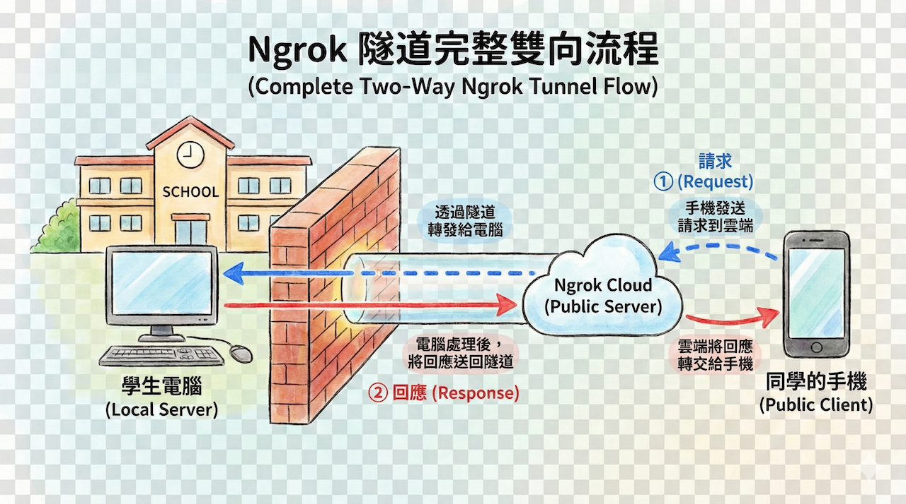

# Ngrok Tunnel

## Ngrok Tunnel是什麼

ngrok tunnel 是一種反向隧道工具，用來將本機 localhost 的服務暴露到公網，讓外部使用者能透過臨時網址存取。

## 運作原理

ngrok 透過建立安全的反向代理通道，將遠端公網請求轉發到本地指定端口，例如將 ngrok.io 的流量 forwarding 到 localhost:3000。它支援穿透 NAT 或防火牆，無需設定路由器或公開端口。

## 常見用途

- 開發階段 demo 本地 web 伺服器給團隊或客戶測試。
- 測試第三方 API 回調，如支付金流或 webhook。
- 產生 公網的HTTPS 網址，支援基本認證保護（如 ngrok http --auth=user:pass 3000）。

## 安裝流程

1. 申請ngrok網址
   - 訪問 [ngrok 網站](https://ngrok.com/)，註冊帳號。
   - 在Getting Started -> Setup & Installation
   - 選取Raspberry Pi的下載方式
   - 使用homebrew安裝ngrok的應用程式
   - **依順序就可以完成**   

下載 ngrok 後，執行 `ngrok http 3000` 即可產生公網網址，如 [https://abc123.ngrok.io](https://abc123.ngrok.io) 指向本地 3000 端口。免費版有流量限制，付費版提供自訂域名與更多功能。
