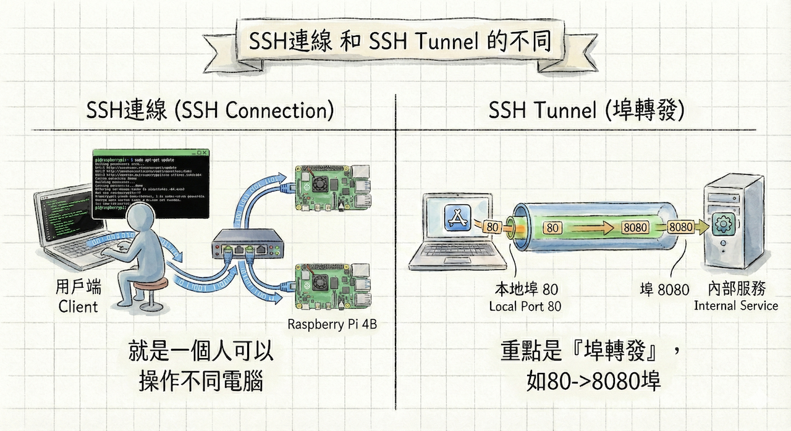

# SSH Tunnel

## 為什麼要SSH Tunnel

## 區域網路
  > [區域網路說明](./local_network.md)

## SSH連線和SSH Tunnel有什麼不同

SSH連線是基本遠端登入功能，而SSH Tunnel則在SSH連線基礎上建立埠轉發通道，實現流量加密轉送與突破限制。



### 主要差別
SSH連線僅提供終端機存取（如`ssh pi@raspberry-ip`執行指令），不改變其他流量路徑；SSH Tunnel額外轉發指定埠流量，例如`ssh -L 8080:localhost:80 pi@raspberry-ip`讓本地8080埠連到Raspberry Pi的80埠服務。

### 主要觀念:

**SSH連線:**

透過1台電腦,可以操控多台伺服器

**SSH Tunnel**
2台電腦拉了一條專屬的安全延長線

### 功能比較

| 方面       | SSH連線                          | SSH Tunnel                          |
|------------|----------------------------------|-------------------------------------|
| **目的**  | 遠端Shell操作與檔案傳輸         | 加密轉發任意TCP流量（如Web、DB）   |
| **指令範例** | `ssh user@host`                 | `ssh -L localport:remotehost:port user@host` |
| **流量範圍** | 僅SSH埠22                       | 多埠轉發，偽裝成SSH流量            |
| **應用**  | 管理伺服器指令                  | 突破防火牆存取內網服務             |[1][6]

#### 1. 概念建立階段 (Concept)

- **痛點引導：**如果 Raspberry Pi 上有一個網頁伺服器只允許 `localhost` (本機) 連線，你要怎麼從你的 Windows 電腦看到它？
- **傳統解法 vs. 隧道解法：**
    - *傳統：* 修改防火牆、開放 Public IP (危險、麻煩)。
    - *隧道：* 透過已經建立的 SSH 連線，把 Raspberry Pi 的某個 Port「對應」到 Windows 的某個 Port。
    
    

#### 2. 環境準備階段 (Setup)

- **Raspberry Pi (Server)：** 確認 SSH 服務已開啟，並安裝一個簡單的服務 (如網頁伺服器或資料庫)。
- **Windows (Client)：**
    - **推薦工具：** Windows 10/11 內建的 PowerShell 或 Command Prompt (CMD) 即可。
    - **備選工具：** 如果需要圖形化理解，可使用 MobaXterm 或 VS Code。

---

### 第二部分：學習範例 (Learning Example)

這裡我們使用 **Local Port Forwarding (本地通訊埠轉發)** 作為最經典的入門範例。

#### 步驟 1：在 Raspberry Pi 上製造一個「情境」

我們需要一個「只有 Pi 自己看得到」的服務。使用 Python 內建的 HTTP 伺服器最快。

請學生在 Raspberry Pi 上輸入：

Bash

```other
# 在 Pi 上建立一個簡單的測試資料夾
mkdir tunnel_test
cd tunnel_test
echo "<h1>Hello from the Secret Tunnel!</h1>" > index.html

# 啟動網頁伺服器，限定只能由 localhost (127.0.0.1) 存取，Port 為 8080
python3 -m http.server --bind 127.0.0.1 8080
```

> **驗證點：** 嘗試直接用 Windows 瀏覽器輸入 Pi 的 IP `:8080`，會發現**連不上**。這證明了防火牆或綁定限制生效中。

#### 步驟 2：在 Windows 上打通隧道

打開 Windows 的 PowerShell，輸入以下指令：

PowerShell

```other
# 語法：ssh -L [Windows本地Port]:[目標IP]:[目標Port] [使用者]@[Pi的IP]
ssh -L 9000:127.0.0.1:8080 pi@192.168.1.100
```

- **9000 (Local Port)：** 這是 Windows 端的入口。
- **127.0.0.1 (Target IP)：** 這是相對於 Pi 而言的目標（因為服務在 Pi 自己身上）。
- **8080 (Target Port)：** Pi 上服務運行的 Port。
- **pi@192.168.1.100：** 登入資訊。

#### 步驟 3：見證奇蹟

打開 Windows 的瀏覽器，網址列輸入：

[http://localhost:9000](http://localhost:9000)

結果： 他們將會看到 "Hello from the Secret Tunnel!"。

解釋： 瀏覽器以為連的是自己的 9000 Port，但其實 SSH 幫你把流量「偷渡」到了 Pi 的 8080 Port。

---

### 第三部分：產生練習的情境 (Practice Scenarios)

為了讓學生理解「為什麼要學這個」，請指派以下三個不同難度的任務情境：

#### 情境一：資料庫管理員的難題 (Database Security)

- **背景：** 你在 Raspberry Pi 上安裝了 MySQL 或 Redis 資料庫。為了安全，設定檔限制 `bind-address = 127.0.0.1`，不准外網直接連線。
- **任務：** 你現在想用 Windows 上的資料庫軟體 (如 DBeaver 或 Workbench) 管理 Pi 裡的資料。
- **解法：** 建立隧道 `L 3306:127.0.0.1:3306`，然後讓 DBeaver 連線 Windows 的 `localhost:3306`。

#### 情境二：Jupyter Notebook 遠端算圖 (Data Science)

- **背景：** 學生在 Pi 上跑 AI 模型訓練，使用 Jupyter Notebook。Jupyter 預設跑在 8888 Port。
- **任務：** 不想把 Jupyter 的密碼暴露在公網，但想在 Windows 舒服地寫 Code。
- **解法：** `ssh -L 8888:localhost:8888 pi@<IP>`，直接在 Windows 瀏覽器寫 Python。

#### 情境三：跳板攻擊 (The Jump Host - 進階)

- **背景：** * 設備 A：Windows (學生)。
    - 設備 B：Raspberry Pi (可連網)。
    - 設備 C：學校內網的一台印表機或是 Web Server (無法直接連網，但 Pi 連得到它)。
- **任務：** 你的 Windows 連不到設備 C，但 Pi 連得到。請把 Pi 當作跳板 (Jump Host)，存取設備 C 的網頁介面。
- **解法：** `ssh -L 8080:<設備C的IP>:80 pi@<Pi的IP>`。這會讓學生理解隧道不只是連到 Pi，還可以透過 Pi 連到更遠的地方。
